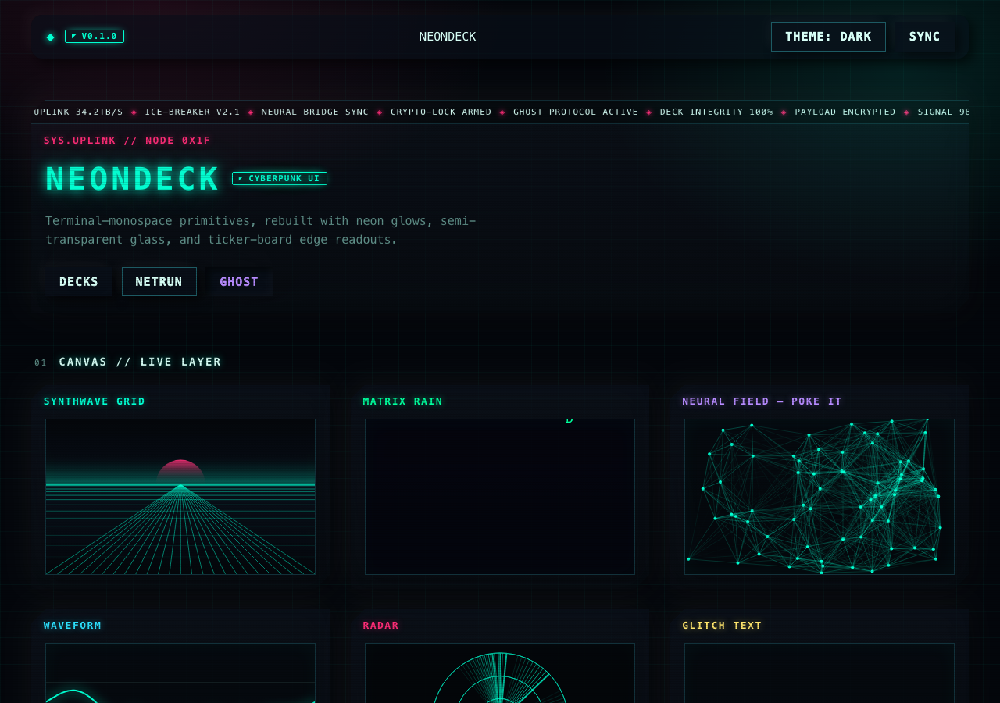
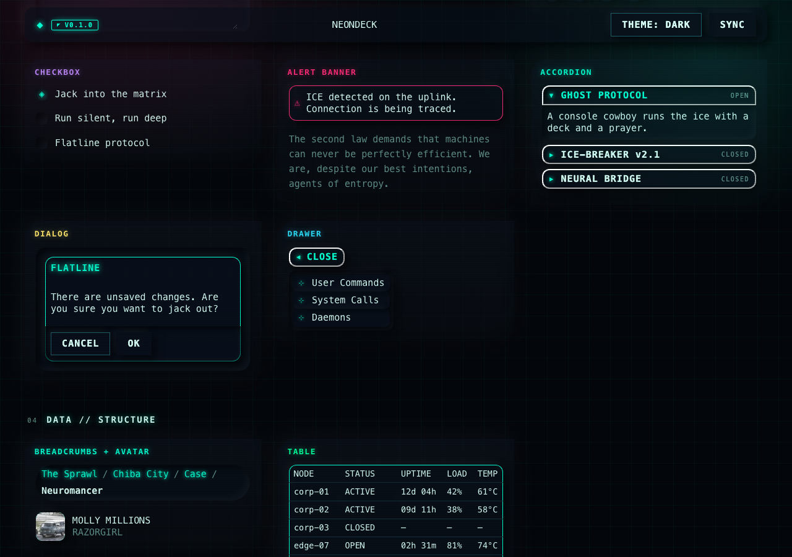
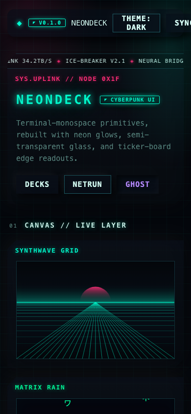
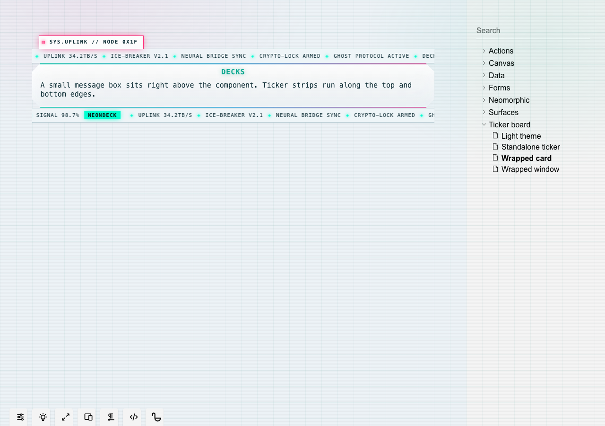

```text
 __   _ _______  _____  __   _ ______  _______ _______ _     _
 | \  | |______ |     | | \  | |     \ |______ |       |____/
 |  \_| |______ |_____| |  \_| |_____/ |______ |_____  |    \_
```


> `//` NEONDECK — a cyberpunk component library for the deck jockeys and netrunners.

**NEONDECK** rebuilds the [SRCL](https://github.com/internet-development/www-sacred)
(www-sacred) terminal-monospace primitives with the
[neon-native-real](https://github.com/) cyberpunk palette — **neon glows**,
**semi-transparent glass panels**, and a signature **ticker-board edge readout**.

Every component is copy-pasteable: one `.tsx` + one `.module.css`, themed entirely
through CSS custom properties (`--theme-*`, `--neon-*`, `--cp-*`).

## 📸 Preview

**Kitchen sink** — the ticker-board hero, `Next.js` app router:



**Component grid** — neon-cornered glass cards:



<div align="center">
  
  
</div>

## ✦ Features

- ⚡ **Neon glows** — teal / magenta / yellow / green / violet / orange / red / blue accents with `text-shadow` + `box-shadow` halos.
- 🪟 **Semi-transparent surfaces** — `rgba()` panels with `backdrop-filter: blur() + saturate()`, plus scanline overlays.
- 📟 **Ticker-board edges** — the signature. A `Ticker` marquee strip runs along an edge, and a small `message` box floats **right above** the component via `TickerBoard`.
- 🧩 **SRCL-shaped API** — `Card`, `Button`, `Accordion`, `Window`, `Select`, `Dialog`… the same prop shapes you already know.

## // Install

```sh
npm install @javierromario/neondeck
```

React 19 is a peer dependency (install alongside if missing):

```sh
npm install react react-dom
```

### 1. Import the stylesheet

Once, at your app root (`app/layout.tsx`, `main.tsx`, etc.):

```tsx
import '@javierromario/neondeck/global.css';
```

`global-fonts.css` is optional — it loads the bundled cyberpunk display font.

### 2. Use the components

```tsx
import { NeoCard, NeoButton, TickerBoard } from '@javierromario/neondeck';

<TickerBoard
  message="SYS.UPLINK // NODE 0x1F"
  messageTone="magenta"
  tickerLabel="NEONDECK"
  tickerItems={['UPLINK 34.2TB/S', 'ICE-BREAKER v2.1']}
>
  <NeoCard title="DECKS" tone="teal">
    <NeoButton tone="yellow">Sync</NeoButton>
  </NeoCard>
</TickerBoard>;
```

### Next.js (App Router)

Several components are client components (`'use client'`). Add the package to
`transpilePackages` so Next honors those boundaries and compiles the CSS modules:

```js
// next.config.mjs
const nextConfig = {
  transpilePackages: ['@javierromario/neondeck'],
};

export default nextConfig;
```

### 3D / canvas components

`Hologram` needs the R3F peer deps (optional — skip unless you use it):

```sh
npm install three @react-three/fiber @react-three/drei
```

### Theming

All color comes from CSS custom properties. Re-theme by overriding tokens on `body`,
or use the shipped tint classes (`body.tint-magenta`, `body.tint-yellow`, …).

## // The ticker-board treatment

Wrap any component in `TickerBoard`:

```tsx
import TickerBoard from '@components/TickerBoard';
import Card from '@components/Card';

<TickerBoard
  message="SYS.UPLINK // NODE 0x1F"   // ◤ small box above the component
  messageTone="magenta"
  tickerLabel="NEONDECK"
  tickerItems={['UPLINK 34.2TB/S', 'ICE-BREAKER v2.1']}
  tickerSpeed={28}
  showBottomTicker
>
  <Card title="DECKS">…</Card>
</TickerBoard>
```

- `message` → the small message box rendered right above the component.
- `tickerItems` → the scrolling ticker feed.
- `showTopTicker` / `showBottomTicker` → which edges get the marquee.
- `tickerTone` / `messageTone` → any of the eight neon tones.

`Ticker` is also available standalone for arbitrary edge strips.

## // Theming — glass & neon

All color comes from `global.css`. Re-theme the whole deck by overriding tokens:

```css
body {
  --theme-focused-foreground: #ff2d78;   /* accent → magenta */
  --theme-button: #ff2d78;
  --theme-panel: rgba(20, 8, 20, 0.55);  /* semi-transparent surface */
}
```

Tint classes ship ready: `body.tint-magenta`, `body.tint-yellow`, `body.tint-green`,
`body.tint-violet`, `body.tint-orange`, `body.tint-red`, `body.tint-blue`.

## // Component catalog

| Primitive | Purpose |
| --- | --- |
| `Ticker`, `TickerBoard` | 📟 Scrolling marquee + edge message box |
| `Card`, `CardDouble` | 🪟 Neon-cornered glass panels |
| `Button` | ⚡ PRIMARY / SECONDARY, disabled |
| `Window` | 🖥 Semi-transparent terminal frame with scanlines |
| `Accordion`, `Dialog`, `Drawer`, `Select` | 🗂 Disclosure + overlay + menu |
| `Badge`, `AlertBanner`, `Divider`, `CodeBlock` | 🏷 Status + copy primitives |
| `ActionBar`, `ActionButton`, `ActionListItem`, `ButtonGroup` | ⌨ Command surfaces |
| `Input`, `TextArea`, `Checkbox`, `BarLoader`, `BarProgress`, `BlockLoader` | ⌨ Forms + progress |
| `Avatar`, `Breadcrumbs`, `Navigation` | 🪪 Identity + navigation |
| `Grid`, `Row`, `RowSpaceBetween`, `ContentFluid`, `Indent` | 📐 Layout |
| `Table`, `TableRow`, `TableColumn`, `ListItem`, `Text` | 🗃 Data + copy |

See `components/AGENTS.md` for the full per-component catalog.

## // Quick start

```sh
npm install
npm run dev          # Next.js kitchen sink → http://localhost:3000
npm run ladle        # Ladle playground → http://localhost:61000
npm run build-ladle  # static Ladle build → build/
npm run screenshot   # Playwright → docs/screenshots/*.png
```

## // Component playground (Ladle)

Components are exercised in [Ladle](https://ladle.dev) — a fast Vite-based
Storybook alternative. Stories live in `stories/*.stories.tsx` and use the CSF
format (`args` + `argTypes` with live controls).

- `.ladle/config.mjs` — Ladle config (story glob, vite config pointer).
- `.ladle/components.tsx` — the `Provider` that wraps every story and pulls in `global.css`.
- `vite.config.mjs` — Vite path aliases (`@components`, `@common`, `@root`).

## // Playwright + MCP

Screenshots are captured with [Playwright](https://playwright.dev). Regenerate them:

```sh
npm run screenshot   # needs `npm run dev` and `npm run ladle` running
```

The [Playwright MCP server](https://github.com/microsoft/playwright-mcp) is bundled
as a dev dependency for agent-driven browser control:

```sh
npx @playwright/mcp
```

## // Credits

- **www-sacred / SRCL** — the gold-standard terminal component library this deck is modeled on.
- **neon-native-real** — the cyberpunk palette and glass aesthetic.
- Banner set in the `cyberlarge` font via [`toilet`](http://caca.zoy.org/wiki/toilet).
